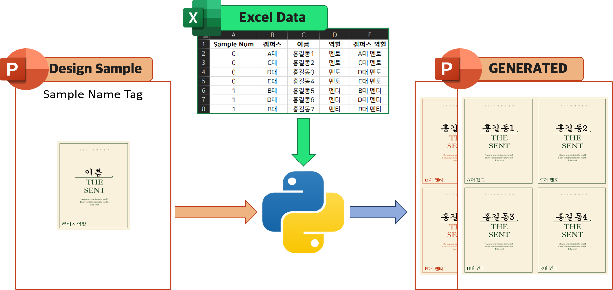
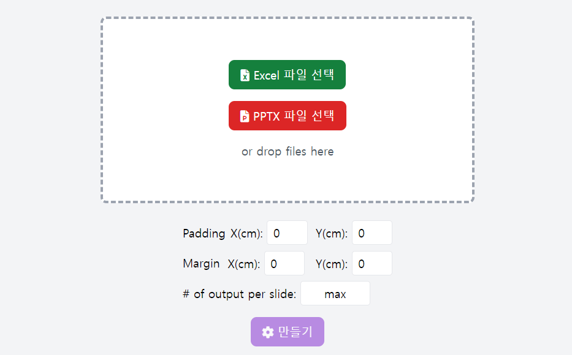

# Automatic Printable NameTag Generator

## Introduction

This project automates the process of generating nametags by extracting data from an Excel file and inserting it into a PowerPoint template, creating a printable format. It reads information from the Excel file and applies it to PowerPoint slides, using a sample template that you design in advance. Each row in the Excel file corresponds to a nametag, and the script customizes the slides based on the template's layout and design.

The generated PowerPoint slides are ready for printing, making the process quick and efficient for generating nametags in bulk. Creating professional nametags has never been easier—give it a try now!"



## Requirements

- Python 3.x
- `openpyxl` library
- `python-pptx` library
- `tkinterdnd2` library

You can install the required libraries using the following command:

```bash
# install dependencies
pip install openpyxl python-pptx tkinterdnd2
npm install
```

## Usage

1. Prepare Excel file: Prepare an Excel file ([attendess_list.xlsx](template/attendess_list.xlsx), for example) containing the information to be included in the nametags. Each row should contain information for one nametag.
2. Prepare PowerPoint sample: Prepare a sample PowerPoint file ([nametag.pptx](template/nametage.pptx), for example) to be used when generating the nametags. For Each sample slide put different layouts and designs for the name badges.
3. Run the script: Execute `main.py` Python script to automatically generate the nametags. You can find the generated nametag PowerPoint `dist/generated-*.pptx`.
4. Check the result: The executed script will generate a new PowerPoint file. Open this file to review the generated nametags.

### Notes

- One silde must contain one sample nametag design.
- Sample nametag's text is substituted with corresponding information from the Excel file if it matches one of the header names. If not, the text will remain unchanged.


## Running the Script
To run the Electron-based GUI

```bash
npm start
```
<div style="text-align: center;">  </div>


## Excel File Format

The Excel file containing the necessary information for the nametags should follow a format similar to the following:

| Sample Num | Campus    | Name          | Position |
| ---------- | --------- | ------------- | -------- |
| 0          | Ajou Univ | Kyunghyun Min | SoonJang |
| 1          | ABC Univ  | Jane Smith    | SoonWon  |

The 'Sample Num' column in the Excel file allows you to select from the provided sample templates. sample slide number is start from 0.
For basic tamplate, [attendess_list.xlsx](template/attendess_list.xlsx) file.


## Additional Running the Script


### **Tkinter GUI Mode:**


   ```bash
   python main.py
   ```

### **Command-line Mode:**


   ```bash
   python main.py --excel 'example/attendees_list-example.xlsx' --pptx 'example/nametag-example.pptx' --padding_x 0 --padding_y 0 --margin_x 0 --margin_y 0 --per_slide 4
   ```

### **Build**
   ```bash
   npm run build-all
   ```

#### Argument Descriptions:

- **`--padding_x`, `--padding_y`:** Set the space between the text and the edges of each nametag (in pixels).
  
- **`--margin_x`, `--margin_y`:** Define the space between nametags and the slide edges, or between nametags (in pixels).

- **`--per_slide`:** Number of nametags per slide (e.g., `4`). If omitted, the script will use the maximum number of nametags per slide.

## File Structure

```
project-root/
│
├── main.py
├── example.py
├── src/
│   ├── draw_slide.py
│   ├── draw_nametag.py
│   ├── draw_shape.py
|   ├── gui.py # thinker GUI
│   ├── utils.py
│   │
│   ├── main.js # Electron GUI
│   ├── renderer.js
│   ├── index.html
│   │
|   ├── morefont_pptx.py 
|   ├── allow_eastaisa_typeface_pptx.py
│   ├── settable_pptx.py
│   └── patch_openpyxl.py
│
└── template/
    ├── attendees_list.xlsx
    └── nametag.pptx
```


### Description

- `main.py`: Main script
- `example.py`: Example run based on files in the example folder
- `src/`: Directory containing source code files, grouped as follows:

  1. **Nametag Creation and Slide Handling:**
     - Files: `draw_slide.py`, `draw_nametag.py`, `draw_shape.py`
     - These files handle the creation, arrangement, and customization of nametags with in PowerPoint slides. They manage the layout and design aspects to ensure that the nametags are correctly drawn and positioned.
  
  2. **GUI and User Interaction:**
     - Files: `gui.py`, `main.js`, `renderer.js`, `index.html`
     - This group provides user interfaces through both Tkinter and Electron. These files make it easy for users to upload Excel and PowerPoint templates, execute the script, and view results in a user-friendly way.
  
  3. **Utilities and Extensions:**
     - Files: `utils.py`, `morefont_pptx.py`, `allow_eastaisa_typeface_pptx.py`, `settable_pptx.py`, `patch_openpyxl.py`
     - These files extend the functionality of core libraries like `python-pptx` and `openpyxl`, adding support for custom fonts, East Asian typefaces, and general utility functions that assist with nametag generation.


## License

This project is licensed under the MIT License. For more information, see the [LICENSE](LICENSE) file.
